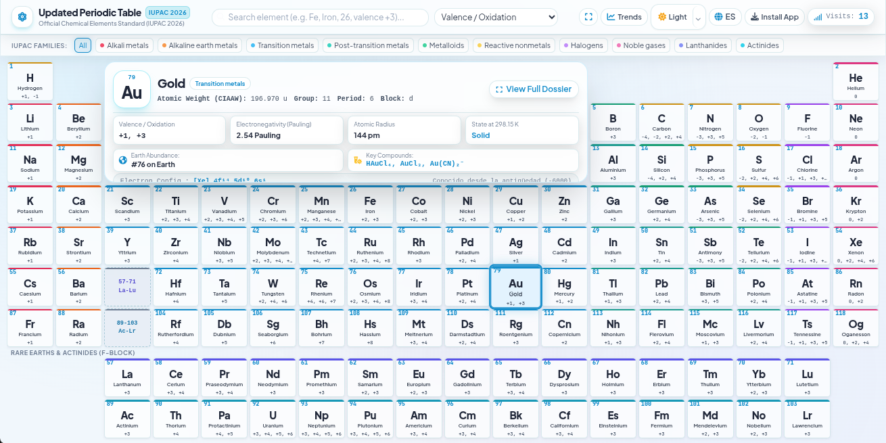

<div align="right">
  <a href="#español">🇲🇽 Español</a> | <a href="#english">🇬🇧 English</a>
</div>

---

<a id="español"></a>
# 🇲🇽 Español

<div align="center">

# ⚛️ Tabla Periódica Actualizada
**Estándar Oficial IUPAC 2026 | Progressive Web App (PWA)**

[](https://opensource.org/licenses/MIT)
[](https://developer.mozilla.org/en-US/docs/Web/Progressive_web_apps)
[](https://developer.mozilla.org/en-US/docs/Web/JavaScript)
[](https://tailwindcss.com/)
[](https://iupac.org/)

Una aplicación web científica de última generación diseñada para la visualización integral, inspección fisicoquímica y análisis interactivo de los 118 elementos químicos. 

[Explorar Demo En Vivo](https://pablo-santana-mx.github.io/IUPAC-Periodic-table/) 

<br/>



</div>

---

## 🌟 Características Principales

### 🔬 Ficha Central Integrada (Hub IUPAC)
Aprovecha el espacio natural de los periodos 1 a 3 (columnas 3 a 12) para mostrar información oficial en tiempo real mediante *hover*, incluyendo masa atómica, electronegatividad, configuración electrónica y más.

### 📊 Visualización Dinámica y Filtros
*   **Selector de Propiedades en Celda**: Cambia dinámicamente la métrica visualizada en la cuadrícula principal (Valencia, Electronegatividad, Masa Atómica, Radio Atómico, Energía de Ionización, Configuración Electrónica o Estado de la Materia).
*   **Cinta de Familias Químicas**: Pestañas de filtrado rápido (*Slim Glass Tabs*) para aislar visualmente grupos como Alcalinos, Metales de Transición, Halógenos, Gases Nobles, etc.
*   **Búsqueda en Vivo**: Filtrado universal por símbolo, nombre, número atómico o familia química.

### 🎓 Academia Química (Modo Didáctico)
Nuevo módulo interactivo diseñado para el aprendizaje y la evaluación:
*   **Quiz Cuántico**: Desafíos para evaluar conocimientos sobre configuraciones electrónicas y números cuánticos.
*   **Memorama**: Emparejamiento interactivo de elementos (Símbolo-Nombre, Símbolo-Valencia, Símbolo-Z).
*   **Efectos Inmersivos**: Soporte de efectos de sonido activables para gamificar la experiencia.

### 🧪 Modal Glass Ultra-Interactivo
Dossier técnico expandido con módulos de análisis profundo:
1.  **Modelo Atómico**: Visualizador interactivo 2D de Bohr en `<canvas>`.
2.  **Valencias y Enlace**: Estados de oxidación oficiales y barra visual de electronegatividad.
3.  **Compuestos Clave**: Catálogo de moléculas principales con botón de copiado rápido.
4.  **Geoquímica**: Abundancia terrestre, océanos, atmósfera, cuerpo humano y origen cósmico.
5.  **Simulador Termodinámico**: Deslizador interactivo (0 K a 4000 K) para calcular el estado de la materia en tiempo real.
6.  **Historia**: Datos del descubrimiento y usos industriales.

### 🌓 Interfaz Avanzada y Accesibilidad (UX)
*   **Gestión de Temas**: Menú desplegable para alternar entre Oscuro (*Neon Glass*), Claro (*Clear Glass*) o Sincronización con el Sistema, con prevención FOUC.
*   **Diseño Fluido**: Soporte de pantalla completa inmersiva, notificaciones flotantes de estado *Offline*, y sugerencias de scroll horizontal inteligente para dispositivos móviles.
*   **Gráficos Chart.js**: Tendencias periódicas (Z vs Propiedades) adaptables al tema.
*   **Text-to-Speech & Teclado**: Síntesis vocal nativa (ES/EN) y navegación 100% por teclado (`Tab`, `Enter`, `Flechas`, `Esc`).
*   **Métricas de Usuario**: Contador visual discreto de visitas en la interfaz.

---

## 📱 PWA & Modo Offline

Funciona **100% sin conexión**. Utiliza un Service Worker (v3) con estrategia *Network-First* y *fallback* a caché local, mostrando una alerta visual discreta cuando no hay conexión. Instalable como aplicación nativa (*standalone*) en Android, iOS, Windows y macOS.

---

## 🛠 Detalles Técnicos y Estructura

<details>
<summary><strong>📁 Ver Estructura del Proyecto</strong></summary>

```text
tabla-periodica-actualizada/
├── index.html        # Estructura semántica, Grid atómico 18x10
├── style.css         # Variables CSS, animaciones glass y responsive
├── app.js            # Dataset IUPAC, temas, Bohr canvas, simulador e i18n
├── sw.js             # Service Worker (v3)
├── manifest.json     # Manifiesto PWA
├── public/           # Archivos estáticos
└── icons/            # Iconografía PWA (192px y 512px)
```
</details>

<details>
<summary><strong>🎨 Paleta de Colores (CSS Variables)</strong></summary>

```css
/* Variables en Modo Oscuro */
html[data-theme="dark"] {
  --bg-deep: #060913;
  --bg-secondary: #0d1424;
  --glass-base: rgba(13, 20, 36, 0.75);
  --text-primary: #f8fafc;
  --accent-primary: #38bdf8;
}

/* Variables en Modo Claro */
html[data-theme="light"] {
  --bg-deep: #f0f6fc;
  --bg-secondary: #e2eeff;
  --glass-base: rgba(255, 255, 255, 0.8);
  --text-primary: #0f172a;
  --accent-primary: #0284c7;
}
```
</details>

<details>
<summary><strong>🔬 Parámetros Verificados (IUPAC / CIAAW)</strong></summary>

| Parámetro | Descripción |
| :--- | :--- |
| **Z, Símbolo, Nombre** | Nomenclatura universal y bilingüe. |
| **Masa Atómica** | Evaluada por la comisión CIAAW. |
| **Config. Electrónica** | Subniveles $s, p, d, f$ y población $K-Q$. |
| **Termodinámica** | Puntos de fusión/ebullión y fases a 298.15 K. |
| **Propiedades** | Electronegatividad, radio atómico y energía de ionización. |

</details>

---

## 🚀 Instalación y Despliegue

### Entorno de Desarrollo (Vite)
```bash
# 1. Clonar el repositorio
git clone [https://github.com/tu-usuario/tabla-periodica-actualizada.git](https://github.com/tu-usuario/tabla-periodica-actualizada.git)
cd tabla-periodica-actualizada

# 2. Instalar dependencias
npm install

# 3. Iniciar servidor local (Puerto 3000)
npm run dev
```

### Alternativa: Servidor Estático Rápido (Python)
```bash
python3 -m http.server 3000
```

### Construcción para Producción
```bash
npm run build
```
Sube la carpeta `dist/` a cualquier servicio de hosting estático (GitHub Pages, Vercel, Netlify).

---

## 💾 Persistencia Local (LocalStorage)

El proyecto guarda preferencias del usuario para una experiencia fluida:
*   `periodicTheme`: (`light` | `dark` | `system`)
*   `zperiod_lang`: (`es` | `en`)
*   `zperiod_visits_count`: Contador local de visitas reflejado en la interfaz principal.

---

## 📬 Contacto y Perfil de Investigación

**Pablo Alberto Santana Flores** <br>
*Científico de Datos | Inteligencia de Decisiones | PhDc en Ciencias Marinas* <br>
Especializado en arquitecturas de datos modernas y Optimization Engines.

* 🌐 **Portafolio:** [pablo-santana-mx.github.io](https://pablo-santana-mx.github.io/)
* 💼 **LinkedIn:** [linkedin.com/in/pablo-santana-mx](https://www.linkedin.com/in/pablo-santana-mx)
* 🐙 **GitHub:** [github.com/Pablo-Santana-MX](https://github.com/Pablo-Santana-MX)
* ✉ **Email:** [pablo.santana@outlook.com](mailto:pablo.santana@outlook.com)

<br>
<br>

---

<a id="english"></a>
# 🇬🇧 English

<div align="center">

# ⚛️ Updated Periodic Table
**IUPAC Official Standard 2026 | Progressive Web App (PWA)**

[](https://opensource.org/licenses/MIT)
[](https://developer.mozilla.org/en-US/docs/Web/Progressive_web_apps)
[](https://developer.mozilla.org/en-US/docs/Web/JavaScript)
[](https://tailwindcss.com/)
[](https://iupac.org/)

A next-generation scientific web application designed for comprehensive visualization, physicochemical inspection, and interactive analysis of the 118 chemical elements.

[Explore Live Demo](https://pablo-santana-mx.github.io/IUPAC-Periodic-table/) 

<br/>

</div>

---

## 🌟 Main Features

### 🔬 Integrated Central Hub (IUPAC Hub)
Leverages the natural space of periods 1 to 3 (columns 3 to 12) to display official real-time information via *hover*, including atomic mass, electronegativity, electron configuration, and more.

### 📊 Dynamic Visualization and Filters
*   **Cell Property Selector**: Dynamically change the metric displayed on the main grid (Valence, Electronegativity, Atomic Mass, Atomic Radius, Ionization Energy, Electron Config, or State of Matter).
*   **Chemical Family Ribbon**: Quick-filter *Slim Glass Tabs* to visually isolate groups like Alkali Metals, Transition Metals, Halogens, Noble Gases, etc.
*   **Live Search**: Universal filtering by symbol, name, atomic number, or chemical family.

### 🎓 Chemical Academy (Educational Mode)
New interactive module designed for learning and testing:
*   **Quantum Quiz**: Challenges to assess knowledge on electron configurations and quantum numbers.
*   **Memory Game (Memorama)**: Interactive element matching (Symbol-Name, Symbol-Valence, Symbol-Z).
*   **Immersive Effects**: Togglable sound effects support to gamify the learning experience.

### 🧪 Ultra-Interactive Glass Modal
Expanded technical dossier featuring in-depth analysis modules:
1.  **Atomic Model**: Interactive 2D Bohr visualizer on `<canvas>`.
2.  **Valences & Bonding**: Official oxidation states and a visual electronegativity bar.
3.  **Key Compounds**: Catalog of primary molecules with a quick-copy button.
4.  **Geochemistry**: Earth abundance, oceans, atmosphere, human body, and cosmic origin.
5.  **Thermodynamic Simulator**: Interactive slider (0 K to 4000 K) to calculate the state of matter in real-time.
6.  **History**: Discovery data and industrial uses.

### 🌓 Advanced UI and Accessibility (UX)
*   **Theme Management**: Dropdown menu to switch between Dark (*Neon Glass*), Light (*Clear Glass*), or System Synchronization, with FOUC prevention.
*   **Fluid Design**: Immersive fullscreen toggle, floating offline status notifications, and smart horizontal scroll hints for mobile devices.
*   **Chart.js Integrations**: Dynamic periodic trend charts (Z vs. Properties) that adapt to the active theme.
*   **Text-to-Speech & Keyboard**: Native bilingual vocal synthesis (ES/EN) and 100% keyboard navigation support (`Tab`, `Enter`, `Arrows`, `Esc`).
*   **User Metrics**: Discreet visual visit counter integrated into the interface.

---

## 📱 PWA & Offline Mode

Works **100% offline**. Uses a Service Worker (v3) with a *Network-First* strategy and local cache fallback, displaying a subtle visual alert when no connection is present. Installable as a native application (*standalone*) on Android, iOS, Windows, and macOS.

---

## 🛠️ Technical Details and Structure

<details>
<summary><strong>📁 View Project Structure</strong></summary>

```text
tabla-periodica-actualizada/
├── index.html        # Semantic structure, 18x10 atomic grid
├── style.css         # CSS Variables, glass animations, responsive
├── app.js            # IUPAC dataset, themes, Bohr canvas, simulator & i18n
├── sw.js             # Service Worker (v3)
├── manifest.json     # PWA Manifest
├── public/           # Static files
└── icons/            # PWA Iconography (192px and 512px)
```
</details>

<details>
<summary><strong>🎨 Color Palette (CSS Variables)</strong></summary>

```css
/* Dark Mode Variables */
html[data-theme="dark"] {
  --bg-deep: #060913;
  --bg-secondary: #0d1424;
  --glass-base: rgba(13, 20, 36, 0.75);
  --text-primary: #f8fafc;
  --accent-primary: #38bdf8;
}

/* Light Mode Variables */
html[data-theme="light"] {
  --bg-deep: #f0f6fc;
  --bg-secondary: #e2eeff;
  --glass-base: rgba(255, 255, 255, 0.8);
  --text-primary: #0f172a;
  --accent-primary: #0284c7;
}
```
</details>

<details>
<summary><strong>🔬 Verified Parameters (IUPAC / CIAAW)</strong></summary>

| Parameter | Description |
| :--- | :--- |
| **Z, Symbol, Name** | Universal and bilingual nomenclature. |
| **Atomic Mass** | Evaluated by the CIAAW commission. |
| **Electron Config.** | Sublevels $s, p, d, f$ and $K-Q$ population. |
| **Thermodynamics** | Melting/boiling points and phases at 298.15 K. |
| **Properties** | Electronegativity, atomic radius, and ionization energy. |

</details>

---

## 🚀 Installation and Deployment

### Development Environment (Vite)
```bash
# 1. Clone the repository
git clone [https://github.com/your-username/tabla-periodica-actualizada.git](https://github.com/your-username/tabla-periodica-actualizada.git)
cd tabla-periodica-actualizada

# 2. Install dependencies
npm install

# 3. Start local server (Port 3000)
npm run dev
```

### Alternative: Fast Static Server (Python)
```bash
python3 -m http.server 3000
```

### Production Build
```bash
npm run build
```
Upload the `dist/` folder to any static hosting service (GitHub Pages, Vercel, Netlify).

---

## 💾 Local Storage Persistence

The project saves user preferences for a seamless experience:
*   `periodicTheme`: (`light` | `dark` | `system`)
*   `zperiod_lang`: (`es` | `en`)
*   `zperiod_visits_count`: Local visit counter reflected in the main interface.

---

## 📬 Contact & Research Profile

**Pablo Alberto Santana Flores** <br>
*Data Scientist | Decision Intelligence | PhDc in Marine Sciences* <br>
Specialized in modern data architectures and Optimization Engines.

* 🌐 **Portfolio:** [pablo-santana-mx.github.io](https://pablo-santana-mx.github.io/)
* 💼 **LinkedIn:** [linkedin.com/in/pablo-santana-mx](https://www.linkedin.com/in/pablo-santana-mx)
* 🐙 **GitHub:** [github.com/Pablo-Santana-MX](https://github.com/Pablo-Santana-MX)
* ✉️ **Email:** [pablo.santana@outlook.com](mailto:pablo.santana@outlook.com)

---

<div align="center">
  <p>Developed under the <strong>MIT</strong> license.<br/>
  Atomic data in accordance with <strong>IUPAC</strong> and <strong>CIAAW</strong>.</p>
</div>
<div align="center">
  <a href="#español">⬆️ Volver arriba (Español)</a> | <a href="#english">⬆️ Back to top (English)</a>
</div>
